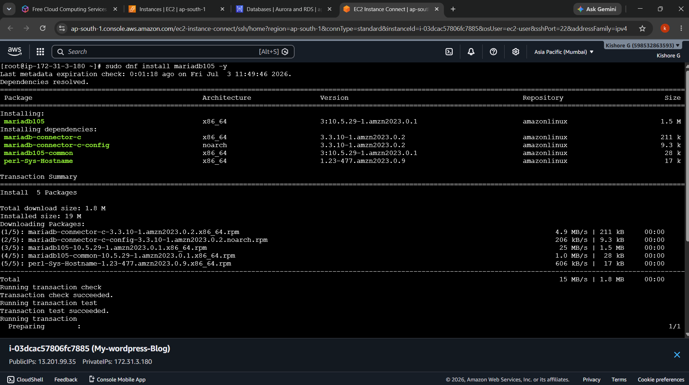
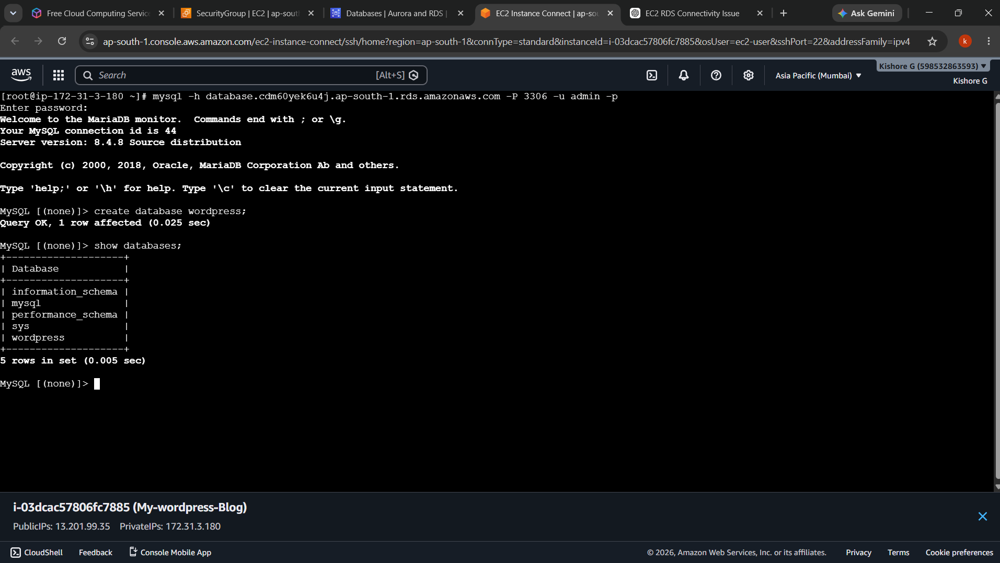
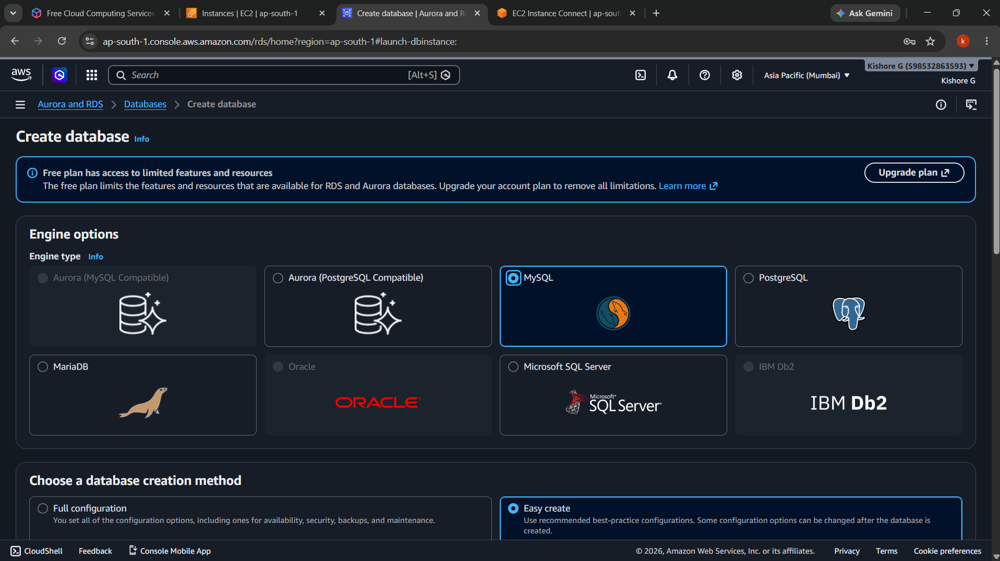
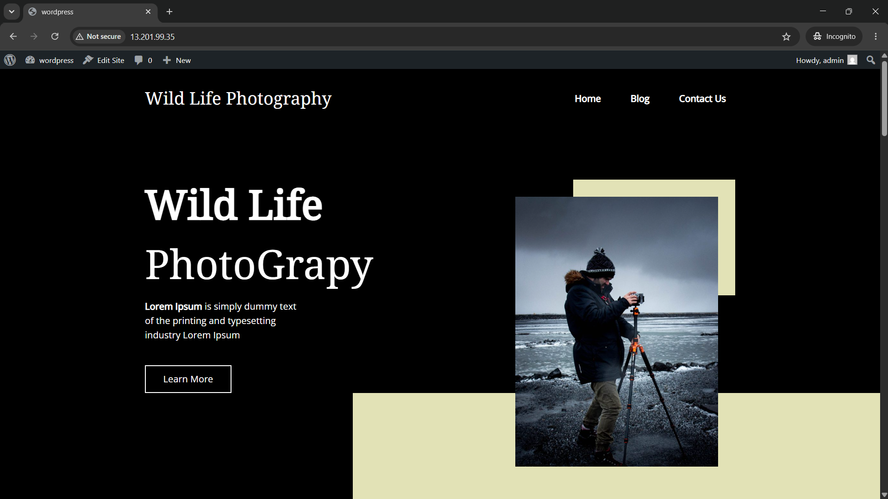
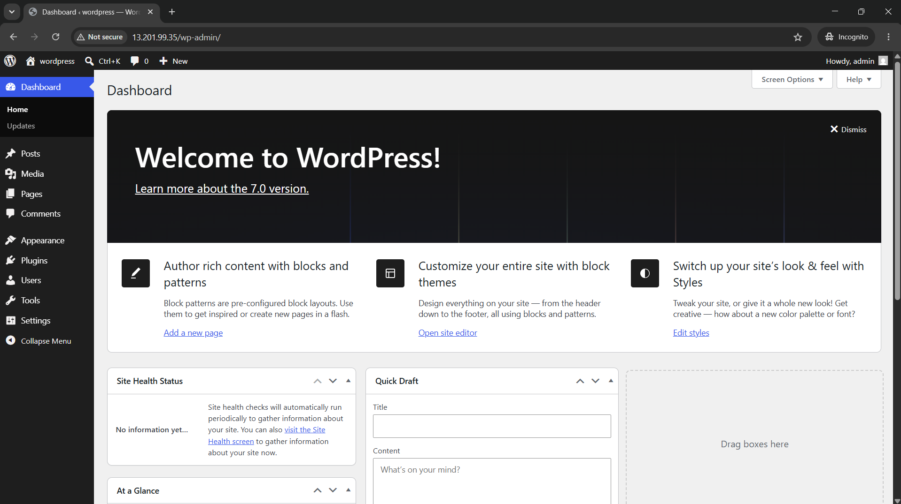

<div align="center">

# ☁️ AWS End-to-End WordPress RDS Deployment

### Deploying a Production-Ready WordPress Website Using Amazon EC2 and Amazon RDS (MySQL)


</div>

---

# 📖 Project Overview

This project demonstrates the deployment of a **production-ready WordPress website** on **Amazon EC2** using **Amazon RDS (MySQL)** as the backend database.

The web server runs on Amazon Linux 2023 with Apache and PHP, while Amazon RDS securely stores the WordPress database. This architecture follows AWS best practices by separating the application and database layers, resulting in improved security, scalability, and reliability.

---

# 🏗️ Architecture

```text
                      Internet
                          │
                    Public IP Address
                          │
                  +------------------+
                  |   Amazon EC2     |
                  | Apache + PHP     |
                  |   WordPress      |
                  +--------+---------+
                           │
                    Port 3306
                           │
                  +--------▼---------+
                  |   Amazon RDS     |
                  |     MySQL        |
                  | WordPress DB     |
                  +------------------+
```

---

# ☁️ AWS Services Used

- Amazon EC2
- Amazon RDS (MySQL)
- Amazon VPC
- Security Groups
- Internet Gateway
- Amazon Linux 2023
- Apache HTTP Server
- PHP
- MariaDB Client
- WordPress

---

# 🚀 Features

- Production-Ready WordPress Deployment
- Amazon EC2 Web Server
- Amazon RDS MySQL Database
- Apache & PHP Configuration
- Secure EC2-RDS Connectivity
- WordPress CMS Installation
- Linux Server Administration
- Cloud Infrastructure Deployment

---

# 🛠️ Implementation Steps

## Step 1 – Launch an EC2 Instance

- Amazon Linux 2023
- Allow SSH (22)
- Allow HTTP (80)

---

## Step 2 – Install Apache

```bash
sudo dnf install httpd -y
sudo systemctl enable httpd
sudo systemctl start httpd
```

---

## Step 3 – Install PHP

```bash
sudo dnf install php php-mysqlnd -y
```

---

## Step 4 – Download and Configure WordPress

```bash
wget https://wordpress.org/latest.tar.gz

tar -xvf latest.tar.gz

sudo cp -r wordpress/* /var/www/html/
```

---

## Step 5 – Create Amazon RDS Database

- Engine : MySQL
- Username : admin
- Port : 3306

---

## Step 6 – Install MariaDB Client

```bash
sudo dnf install mariadb105 -y
```

---

## Step 7 – Connect EC2 to Amazon RDS

```bash
mysql -h <RDS-ENDPOINT> -P 3306 -u admin -p
```

---

## Step 8 – Create WordPress Database

```sql
CREATE DATABASE wordpress;

SHOW DATABASES;
```

---

## Step 9 – Configure WordPress

```bash
cp wp-config-sample.php wp-config.php
vi wp-config.php
```

Update:

```php
DB_NAME     = wordpress
DB_USER     = admin
DB_PASSWORD = YourPassword
DB_HOST     = RDS-ENDPOINT
```

---

## Step 10 – Complete WordPress Installation

Visit:

```
http://<EC2-Public-IP>
```

Complete the WordPress setup wizard.

---

# 📸 Project Screenshots

## 💻 MariaDB Client Installation



---

## 🔗 EC2 Connected to Amazon RDS



---

## 🗄️ Amazon RDS MySQL Creation



---

## ⚙️ WordPress Admin Dashboard



---

## 🌐 WordPress Home Page



---

# 📁 Project Structure

```text
AWS-End-to-End-WordPress-RDS-Deployment/
│
├── README.md
├── amazon-rds-mysql-creation.png
├── ec2-rds-database-connection.png
├── mariadb-client-installation.png
├── wordpress-admin-dashboard.png
└── wordpress-homepage.png
```

---

# 🎯 Skills Demonstrated

- Amazon EC2
- Amazon RDS (MySQL)
- WordPress Deployment
- Apache HTTP Server
- PHP
- MariaDB Client
- Linux Administration
- Cloud Infrastructure
- Security Groups
- VPC
- Database Connectivity

---

# 📚 Learning Outcomes

- Launched and configured an Amazon EC2 instance.
- Installed Apache, PHP, and WordPress.
- Created and configured an Amazon RDS MySQL database.
- Connected Amazon EC2 with Amazon RDS using the MariaDB client.
- Configured WordPress with an external database.
- Deployed a production-ready WordPress application on AWS.
- Strengthened practical skills in cloud infrastructure, Linux administration, and database connectivity.

---

# 👨‍💻 Author

**Kishore G**

**Aspiring AWS Cloud & DevOps Engineer**

- **GitHub:** https://github.com/KISHORE-2605
- **LinkedIn:** https://www.linkedin.com/in/kishore-g005

---

<div align="center">

### ⭐ If you found this project helpful, please consider giving it a Star!

**Thank you for visiting my repository! 🚀**

</div>
